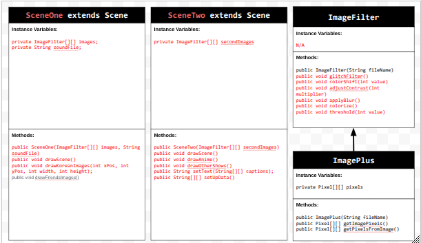
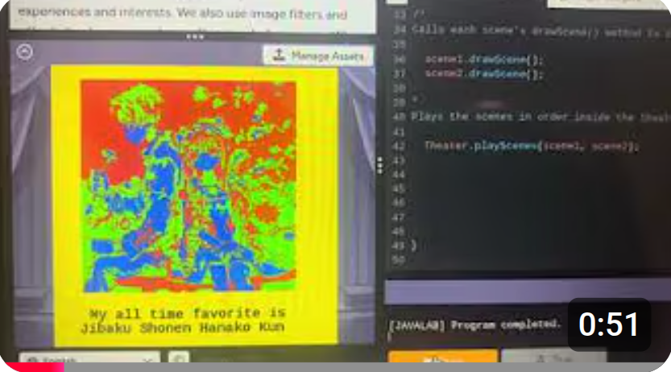

# Unit 5 - Personal Narrative / Interest Animation

## Introduction

Images are often used to portray our personal experiences and interests. We also use image filters and effects to change or enhance the mood of an image. When combined into collages and presentations, these images tell a story about who we are and what is important to us. Your goal is to create an animation using The Theater and Scene API that consists of images of your personal experiences and/or interests. In this animation, you will incorporate data related to these experiences and/or interests that can be organized in a 2D array, and use image filters and effects to change or enhance the mood of your images.
## Requirements

Use your knowledge of object-oriented programming, two-dimensional (2D) arrays, and algorithms to create your personal narrative collage or animation:
- **Write Scene subclasses** – Create two Scene subclasses: either two core parts of your personal life, or two components of a personal interest. Each class must contain a constructor and private instance variable with data related to the scene
- **Create at least two 2D arrays** – Create at least two 2D arrays to store the data that will make up your visualization.
Implement algorithms – Implement one or more algorithms that use loops and logic that operate on the data in your 2D arrays.
- **Create a visualization** – Create an animation that conveys the story of the data by illustrating the patterns or relationships in the data.
- **Image Filters** – Utilize the image filters created in this unit (and possible new filters) that show a personal flare to the images used in your animation.
- **Document your code** – Use comments to explain the purpose of the methods and code segments and note any preconditions and postconditions.

## UML Diagram

## Video

)

## Story Description

My animation showcases different aspects of my identity and personal interests through images, texts, and engaging filters. The first scene highlights around cultural and social elements such as the hanbok, janggu, and my friends, while the second scene focuses on animes and shows I like watching. The images are organized using 2D arrays, wehre each row represnts a category for the topic and each column stores related images. I also used a 2D String array to orgainze captions that are concatenized into text displayed during the animation. These 2D arrays help structure my animation by grouping related content together, making the code easier to read (less instance variables), and making it easy to access and display.

## Image Filter Analysis

Choose at least 2 filters used in your animation to explain how the pixels are modified. If you created a new image filter that was not one of the ones from this unit, make sure to explain and analyze that filter(s) before choosing ones that came from this unit.

One filter I used is the glitchFilter(), which randomly changes each pixel's red, green, and blue values by subtracting or adding 50 from the value, creating the glitch effect. The RGB values are limited to stay between 0 and 255 so that the values remain valid. I also used the applyBlur(), which replaces each pixel's color with the average RGB values surrounding the pixel on a 3x3 grid. This averaging smooths out sharp differences between pixels, making the image appear blurred. These filters show how modifying pixel values in a 2D array can make images more engaging and enhance the overall quality of the animation.